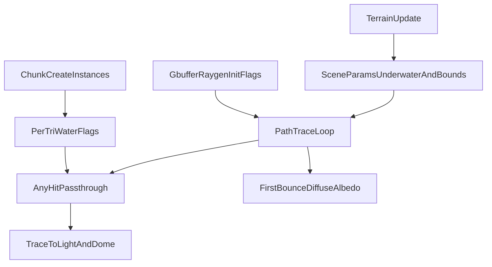

# Voxel Water Volume Absorption Plan

## Scope and invariants

- Keep all behavior unchanged when `sceneParams.voxelMode == 0`.
- Replace water surface tint with neutral water surface material (`baseColor = (1,1,1)`), and move coloration to volume attenuation using `sigmaA = (0.35, 0.08, 0.02)`.
- Track underwater state per ray/path and apply Beer-Lambert on every traveled segment (including passthrough and direct-light visibility rays).

## Data model updates

- Extend per-triangle metadata to identify water triangles:
  - [c:/Users/SDOAJ/code/biomeinator/src/rendering/common/common_structs.h](c:/Users/SDOAJ/code/biomeinator/src/rendering/common/common_structs.h)
  - [c:/Users/SDOAJ/code/biomeinator/src/rendering/common/common_structs.cpp](c:/Users/SDOAJ/code/biomeinator/src/rendering/common/common_structs.cpp)
- Add `TRIANGLE_FLAG_IS_WATER` and `flags` field in `PerTriangleData`, preserving 16-byte alignment.
- Extend shader payload flags with `PAYLOAD_FLAG_UNDERWATER`:
  - [c:/Users/SDOAJ/code/biomeinator/src/shaders/payload.hlsli](c:/Users/SDOAJ/code/biomeinator/src/shaders/payload.hlsli)
- Extend scene params with voxel render bounds and camera-underwater state:
  - [c:/Users/SDOAJ/code/biomeinator/src/rendering/common/common_params.h](c:/Users/SDOAJ/code/biomeinator/src/rendering/common/common_params.h)
  - [c:/Users/SDOAJ/code/biomeinator/src/rendering/param_block_manager.cpp](c:/Users/SDOAJ/code/biomeinator/src/rendering/param_block_manager.cpp)

## CPU-side voxel state and bounds

- In terrain update, compute and store:
  - `cameraUnderwater` (false when camera chunk is missing/not ready/not rendered, per your decision).
  - voxel render bounds (min/max X/Z from current render distance, plus min/max Y chunk bounds).
- Expose terrain-derived water/bounds state via terrain API:
  - [c:/Users/SDOAJ/code/biomeinator/src/terrain/terrain.h](c:/Users/SDOAJ/code/biomeinator/src/terrain/terrain.h)
  - [c:/Users/SDOAJ/code/biomeinator/src/terrain/terrain.cpp](c:/Users/SDOAJ/code/biomeinator/src/terrain/terrain.cpp)
- Populate `sceneParams` each frame in renderer (including conversion/update relative to global instance offset when needed):
  - [c:/Users/SDOAJ/code/biomeinator/src/rendering/renderer.cpp](c:/Users/SDOAJ/code/biomeinator/src/rendering/renderer.cpp)

## Geometry/per-triangle flagging

- Update `Instance` API/contract so callers explicitly fill per-triangle metadata before finalization:
  - expose `host_perTriDatas` for population (instead of only implicit resize),
  - assert in `finalizeGeometry()` that per-triangle data count matches triangle count.
  - [c:/Users/SDOAJ/code/biomeinator/src/scene/scene.h](c:/Users/SDOAJ/code/biomeinator/src/scene/scene.h)
  - [c:/Users/SDOAJ/code/biomeinator/src/scene/scene.cpp](c:/Users/SDOAJ/code/biomeinator/src/scene/scene.cpp)
- Update voxel chunk instance creation to populate `host_perTriDatas` and set `TRIANGLE_FLAG_IS_WATER` for water triangles:
  - [c:/Users/SDOAJ/code/biomeinator/src/terrain/chunk.cpp](c:/Users/SDOAJ/code/biomeinator/src/terrain/chunk.cpp)
- Update GLTF loading path to satisfy the new `Instance` per-triangle-data requirements (non-water triangles default flags):
  - [c:/Users/SDOAJ/code/biomeinator/src/scene/gltf_loader.cpp](c:/Users/SDOAJ/code/biomeinator/src/scene/gltf_loader.cpp)

## Shader absorption integration

- Add shared helpers (voxel-only guarded):
  - water sigma constant,
  - per-segment attenuation `exp(-sigmaA * distance)` when underwater,
  - underwater state toggling when crossing water interfaces (using per-triangle water flag + front/back context).
- Apply these helpers in:
  - primary PT bounce loop + passthrough branch:
    - [c:/Users/SDOAJ/code/biomeinator/src/shaders/path_tracing.rgs.hlsl](c:/Users/SDOAJ/code/biomeinator/src/shaders/path_tracing.rgs.hlsl)
  - anyhit passthrough for refraction/transmittance rays:
    - [c:/Users/SDOAJ/code/biomeinator/src/shaders/path_tracing_common.hlsli](c:/Users/SDOAJ/code/biomeinator/src/shaders/path_tracing_common.hlsli)
  - direct area-light visibility:
    - [c:/Users/SDOAJ/code/biomeinator/src/shaders/light_sampling.hlsli](c:/Users/SDOAJ/code/biomeinator/src/shaders/light_sampling.hlsli)
  - dome/sun visibility:
    - [c:/Users/SDOAJ/code/biomeinator/src/shaders/dome_light.hlsli](c:/Users/SDOAJ/code/biomeinator/src/shaders/dome_light.hlsli)
- For unbounded rays, intersect ray with voxel render bounds and use that distance for attenuation (your requested miss behavior).

## Material and diffuse-albedo behavior

- Remove water surface tint by setting water material base color to white:
  - [c:/Users/SDOAJ/code/biomeinator/src/terrain/terrain_materials.cpp](c:/Users/SDOAJ/code/biomeinator/src/terrain/terrain_materials.cpp)
- Ensure first-bounce diffuse albedo always reflects actual traveled-medium attenuation:
  - if reflection path traverses water, include absorption,
  - if transmission path traverses water, include absorption,
  - if primary ray traverses water before hitting diffuse, include absorption.
  - [c:/Users/SDOAJ/code/biomeinator/src/shaders/path_tracing.rgs.hlsl](c:/Users/SDOAJ/code/biomeinator/src/shaders/path_tracing.rgs.hlsl)
  - [c:/Users/SDOAJ/code/biomeinator/src/shaders/materials.hlsli](c:/Users/SDOAJ/code/biomeinator/src/shaders/materials.hlsli)

## Validation

- Build and run voxel mode smoke checks:
  - camera above water: no water-surface blue tint, underwater color only via path length.
  - camera underwater: all paths attenuate until exiting.
  - passthrough/direct light/dome light: attenuation visible and consistent.
- Run existing rendering tests (non-voxel) to confirm no regression.

## Additional touchpoints you did not explicitly list (but should be included)

- Miss-ray attenuation path for dome/sky and unbounded rays via voxel render bounds intersection.
- Verify existing GBuffer -> PT payload flag handoff for initial underwater state; only change if mismatch is found.
- Scene/global-instance-offset interaction for bounds used in shader-space ray calculations.

