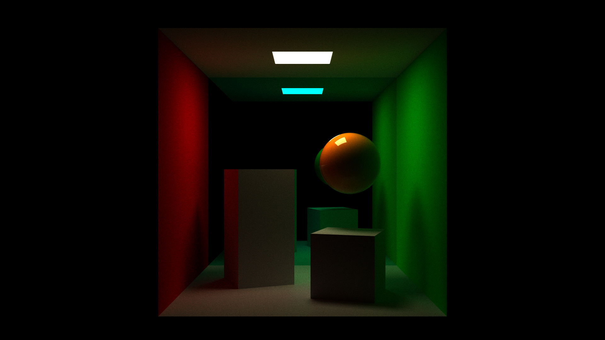

# Biomeinator

Real-time path traced voxel engine

(this is just a test scene, I will put actual voxel terrain here once it exists lol)

## Building

You should be able to just open the folder with Visual Studio 2022 and have it automatically recognize the CMake project.

Or, you can:

- Run `setup.bat`
  - You might need some Windows SDK installed, not sure because I haven't tested this step in a clean environment
- Load the Visual Studio solution at `build/Biomeinator.sln`
- Right-click "Biomeinator" in the Solution Explorer and set as default startup project
- Build and run

Once the project is running, you can open a glTF scene from `test_scenes/` with <kbd>Ctrl</kbd> + <kbd>O</kbd>

## Third-Party Licenses

This project uses various third-party libraries:

- [tinygltf](https://github.com/syoyo/tinygltf) - MIT
- [stb](https://github.com/nothings/stb) - MIT
- [Slang](https://github.com/shader-slang/slang) - Apache-2.0 WITH LLVM-exception
- [DirectXShaderCompiler](https://github.com/microsoft/DirectXShaderCompiler) - University of Illinois Open Source

All third-party licenses are available in `external/licenses/`.
