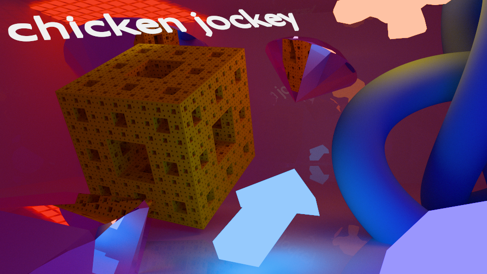

# Biomeinator

Real-time path traced voxel engine

(this is just a test scene, I will put actual voxel terrain here once it exists lol)

## Building

Make sure to clone with `--recurse-submodules` to gather all required dependencies.

Then, you should be able to just open the folder with Visual Studio 2022 and have it automatically recognize the CMake project.

Or, you can:

- Run `setup.bat`
  - You probably need CMake installed for this to work
- Load the Visual Studio solution at `build/Biomeinator.sln`
- Right-click "Biomeinator" in the Solution Explorer and set as default startup project
- Build and run

Once the project is running, you can open a glTF scene from `test_scenes/` with <kbd>Ctrl</kbd> + <kbd>O</kbd>.

## Third-Party Licenses

This project uses various third-party libraries:

- [tinygltf](https://github.com/syoyo/tinygltf) - MIT
- [json](https://github.com/nlohmann/json) - MIT
- [stb](https://github.com/nothings/stb) - MIT
- [cxxopts](https://github.com/jarro2783/cxxopts) - MIT
- [DirectXShaderCompiler](https://github.com/microsoft/DirectXShaderCompiler) - University of Illinois Open Source
- [DirectX-Headers](https://github.com/microsoft/DirectX-Headers) - MIT
- [Minimal AgX implementation](https://iolite-engine.com/blog_posts/minimal_agx_implementation) - MIT
- [Khronos PBR Neutral tonemapper](https://github.com/KhronosGroup/ToneMapping) - Apache-2.0
- [NVAPI](https://github.com/NVIDIA/nvapi) - MIT

Third-party license text files are available in their respective folders in `external/`. Licenses without specific folders are in `external/_licenses`.
